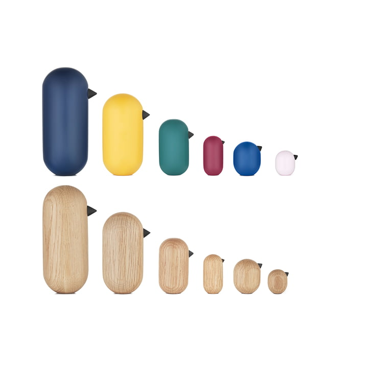

# Questions and investigations on time

## To start questioning the relationship to time, to the tools we use to measure it, I ask questions to people close to me (and myself) and one or two days later I collect the answers.

### What means do you use to find your way through time? How often?

1.Loun :

PC, telephone, watch with dial, kitchen clock

I check every time I need to be on time or I have a specific schedule (ex: appointment, I have to get up tomorrow, cooking something...) otherwise almost never

The phone is always in my bag/on my desk, the PC it depends on the PC but usually in my bed (if not the PC at work), the clock on the big wall of my kitchen, the watch on my wrist (but not very often)

Otherwise to know the weather I rely on public lighting, the number of cars, the number of passers-by, the bell of the school where I live.

Also the opening hours of the stores (for example I know that such and such a store closes at such and such a time and that locates me).

2.Myself :

I watch my phone a lot for no reason, sometimes several times in the same minute, otherwise I watch the time of the microwaves and the washing machines a lot, it is less invasive than the time of my phone or the clocks. 

For a while in the morning my cue was the passage of the garbage collectors in the street, this is the signal that it is too late to sleep.

When I have to do things I also often time myself in the number of songs that have passed while I'm doing a task (showering, cooking, commuting) and I make (false) estimates from that.

3.Julia : 

I look at the time on screens, mainly computer and phone. on average every 10 minutes. I look at the time on a device close to me.

### What is your relationship with time?

1.Loun :

It's complicated, I like the concept of time I find it beautiful but somehow I have the impression that it is very abstract?

I think that time is absurd in the same way that space is absurd but now that I think about it I think that it's probably the gigantism of time that impresses me. Even when nothing existed, time existed and nothing existed for such and such a period of time, and maybe time didn't even exist at that moment but it was still there because time never stops!

2.Myself :

I have a rather passive relationship to time, I think that the way we conceptualized time is really like water.

3.Julia : 

I need to have the time at all times, to have it accessible, and it creates a lot of anxiety for me not to have access to it. Time is something that stresses me a lot, so I have a hard time planning it, I have a hard time saying to myself "Tuesday from 4 to 5 pm, I'll do this".

### How do you plan your time?

1.Loun:

I plan a lot, I try to always be ahead, I have schedule agendas with specific times, I take my watch when I go to exams or stuff like that, I don't want to be caught short by time 

2.Me:
Hard to manage time, I think I tend to like to make myself overwhelmed or just feel overwhelmed, but when I have time on my hands it's very cool to walk in random directions and go in circles on the street. Otherwise if I have something to do but I have "unassigned" time to do something before but I can't really fit any real activity in, it makes me go into a kind of lame paralysis. 

So I may have a bit of a tendency to over-plan so I don't have to plan for real and make choices by importance when the time comes. For example I make a lot of to-do lists but not always to keep track of them.

3.Julia: 

**waiting**

### What was the longest hour in your last day?
1.Loun:

The hour that seemed the longest today was really the 15 minutes of waiting in the street with my three bags of filming equipment, that was crazy long, felt like at least 45 min.

2.Me: 

The longest hour was probably the hour back on the bus/train which is kind of weird because I love commuting but it was probably the lack of energy to enjoy it that made it long.

3.Julia: 

**waiting**

### Special tricks / facts observed about you and your temporality
1.Loun:

When I'm tired, the music and conversations seem to speed up, last less time. When I am energetic, music seems to be at its proper speed but "slowed down" and "broken down" by notes (I notice more things, I pay more attention)

The older I get, the faster time passes

When I'm embarrassed or uncomfortable I feel like time is going super slow, even if I just think back to the memory of the thing that's making me cringe

2.Me: 

A pretty amazing thing that happens sometimes is that I feel like I can make connections between periods of my life that have nothing to do with each other, I think a matter of a repeating cycle of evolution but for example, my sophomore year was the same kind of year as my sophomore year at art school and my third grade very similar to my fifth.

3.Julia: 

**waiting**

### Interesting Links/Tips

To get real time data on important topics it's always fun to check out [Worldometer](https://www.worldometers.info/)

[Quipu](https://en.wikipedia.org/wiki/Quipu) is a south American recording and storage system that is fashioned with knots on cotton strings

## After this first phase of questionnaire the research will continue focused on "time sequencing devices" (Kettles, microphones, etc.)
### (Kettles, microwave, washing machine, oven, dishwasher, elevators)

These appliances have their own temporality which is not linked to the progress of time with a capital T. That's why I chose the name of time sequencers, they have a very precise function and a time that depends only on this task to accomplish. The second counter of the microwave can very well start between two "real seconds" of a watch on time.
Two washing machines located in meridians that start their cycles at the same time can live one hour in common.

  

Two examples of the use of time sequencing devices in fiction as time machines.

Microwave interface

## Questionnaire about the waiting times related to the use of time sequencers

### What do you do while your washing machine is running?

Me: Sometimes I watch it running or listen to the sound of the drum, otherwise I try to find an activity that can fit into this time, it can help me do things if I have the timer on the washing machine, as it's in a laundromat I need to get it out at the right time necessarily otherwise I don't know where I'm going to find my clothes.

### What do you do while your microwave is heating?

Me: I often don't look at the screen and walk around counting in my head trying to get to the end of the timer.

### What do you do while your dishwasher is running?

Me: I've never had one in my house but since we can afford to leave the dishes in there for a long time I tend to ignore it.

### What do you do while waiting for the elevator?

Me: For the elevator, like the microwave I tend to try to predict when it's going to get to which floor, and the same inside while it's going up.

### What do you do while waiting for something to cook in the oven?

Me: I'll poke it every 10 min because the cooking time in recipes is rarely adaptable to all ovens so not very reliable.

### What do you do while waiting while toasting bread?

Me: I check to make sure it's not burning and sometimes I try to anticipate its ejection.

The answers of the people who filled in this questionnaire confirmed the assumptions I had about the impact of these parallel temporalities induced by these objects. The temporal sequencers are constraining our time management since we engage in an interaction with them in order to be able to pursue a supposed activity but this implies entering their temporal cycle.

As you are watching the microwave, you are also looking at yourself.

Experiment to do with time sequencers: 
- create a coexistence between two very distant machines by having them dissolve a message for each other in a cycle that gives the message intention.
- use their windows as mirrors and tell stories with what happens in transparency

[Micro onde hacké avec une Rasberry PI](https://www.generation-nt.com/actualites/raspberry-pi-microwave-four-micro-ondes-hack-1760862)

The temporality of the microwave has this very special thing that it can be interrupted, lengthened or shortened at any moment of its flow.

# Construction of a narrative and first ideas for objects

About the status of the object, consider George Lucas definition of the MacGuffin, more coherent with an object design proposal than the Hitchcockian definition of the term. I'm looking for fictionnal examples that has the object status that interrests me for this project. Examples where the characters can see, and touch the MacGuffin, have interactions with him and have an evoluting relationship with it.

Works of fiction containing a McGuffin   : 
- Hellraiser puzzle box
- The briefcase Pulp fiction
- The plans of the dead Star Star Wars
- The heart of the ocean Titanic

About the gesture with this temporal MacGuffin, you would need to insert an object physically like a coin (but not a coin) maybe a ball. Depending of the size of the ball you are giving more or less time to it, and his output depends of the chain of decision your gonna make with it.

Maybe it begins its output when you slide your hands in the two gloves/pockets on the side. These pockets are gonna be the way the MacGuffin detects your presence and attention to the output he his giving you back. This places the way you are holding it between a hug and a constrain.

Simple test of narrative structure

To simulate a "time input", i'm thinking of using a winder 

And to add the idea of a wearable that could play music, a really great reference object would be these wind up toys shaped like birds. You could wear it perched on your wrist or shoulder so he can sing you something. You just need to wind it up sometimes.

Also the good thing with the bird idea is that it is super easy to suggest a bird with a really simple design with a beak.

# Prototypes

First prototype, having an idea of the form and proportions of the bird.

