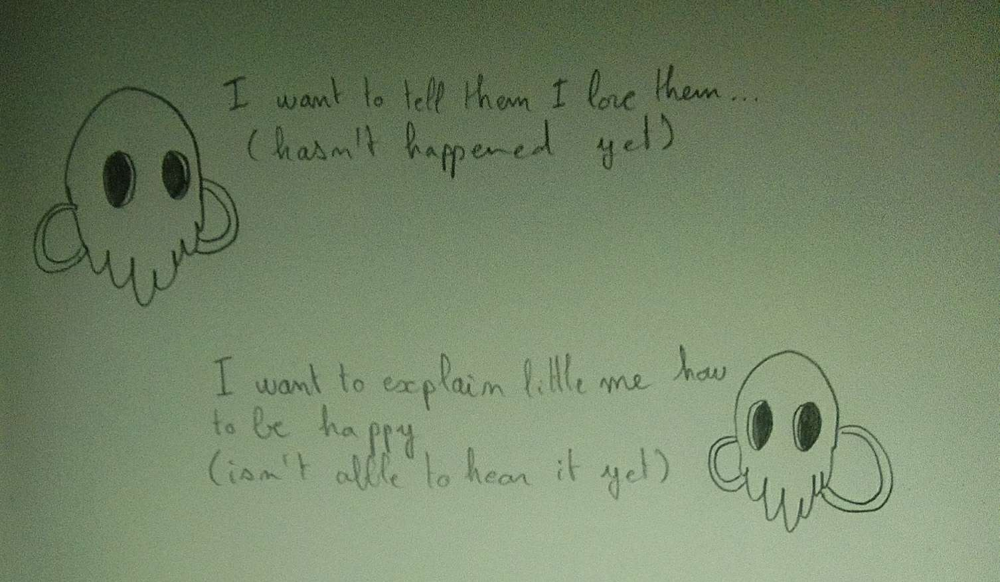

# Treat your Time

- Due date: 2022-11-02:09:00

Times sequencers are objects that forces their timelines into ours in order to function. To get to communicate easily with them you need to change the way you treat your own time. Tame thoses devices surrounding you.

I started to think about a world where you need to adapt your actions to the temporality you are interacting with, to influence it the right way.

